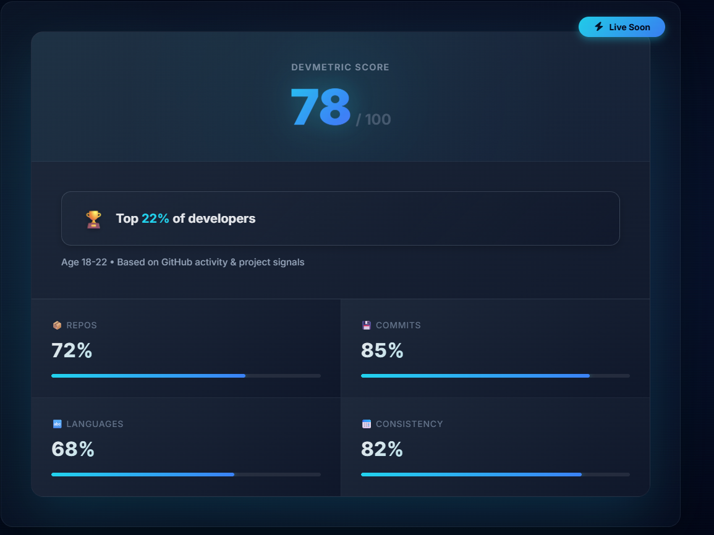
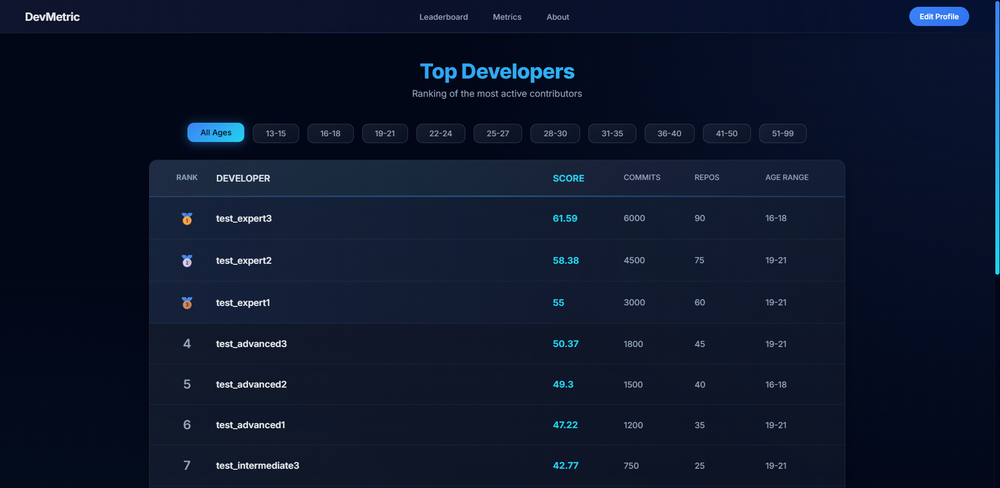

## 🚀 DevMetric — Developer Analytics & Ranking Platform

> Track your GitHub impact and discover where you rank among developers worldwide

 

---

## 📊 Overview

DevMetric analyzes your GitHub activity and ranks you against developers in your age range. Get insights into your coding patterns, track your growth, and see how you stack up globally.

---

## ✨ Key Features

- 📈 **Real-time Analytics** — Live tracking of commits, PRs, and issues  
- 🏆 **Percentile Ranking** — See where you stand vs peers  
- 🔥 **Contribution Heatmap** — Visualize your coding patterns  
- 📊 **Interactive Dashboard** — Clean, responsive interface  
- 🎯 **DevMetric Score** — Comprehensive developer rating system  
- 🌍 **Global Leaderboards** — Compare yourself worldwide  
- 🎨 **Shareable Badges** — Show off your rank  

---

## 🖼️ Screenshots

### Dashboard

### Leaderboard

### Home Page

---

## 🛠️ Tech Stack

### Frontend
- React 18  
- Vite  
- React Router  
- Custom CSS animations  
- Chart.js  

### Backend
- FastAPI (Python 3.14)  
- GitHub OAuth  
- Real-time data processing  

### Infrastructure
- Vercel / Netlify  
- MySQL  
- Redis  

---

## 🎯 Use Cases

- **Job Seekers** — Quantify your skills with verified metrics  
- **Students** — Build a portfolio that stands out  
- **Developers** — Track growth and maintain consistency  

---

## 🔗 Links

- 🌐 **Live App:** https://devmetric.app 
- 📧 **Contact:** corywolf333@gmail.com
- 💼 **LinkedIn:** [https://linkedin.com/in/yourprofile  ](https://www.linkedin.com/in/cory-wolf-64b441231/)

---

## 🚀 Status

Currently in **Beta** — accepting waitlist signups for premium features.

👉 [Join the Waitlist](https://devmetric.app)

---

## 📝 About

DevMetric solves a common problem: developers lack a standardized way to quantify GitHub activity.

We use **percentile-based rankings** to provide meaningful context.

**Why percentiles?**  
Raw numbers don’t tell the full story. Being in the top 10% of developers in your age group gives recruiters and developers real perspective.

---

## 🏗️ Development

This is a **proprietary project**. The source code is closed, but the live demo is publicly available.

Interested in collaborating?  
📬 corywolf333@gmail.com

---

## 📄 License

Copyright © 2026 DevMetric.  
All rights reserved.

---

⭐ Star this repo if you find the project interesting!
